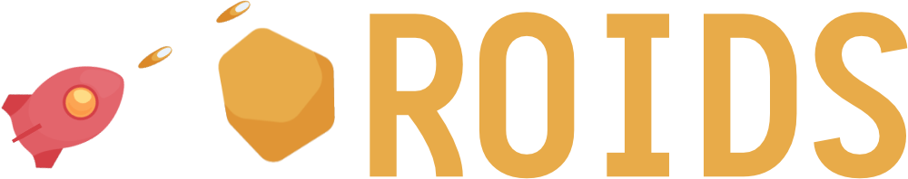

# Defold sample game by KaiOS

Welcome to the ["Roids" sample game](https://github.com/defold/sample-roids) which modified by KaiOS. This is a very simple "Asteroids" clone where you turn the ship left and right key on your KaiOS device and fire at incoming meteors with <kbd>Enter</kbd> or <kbd>Num 5</kdb>.

[Play the game!](defold://build)

## Features
- Support KaiOS 1.0 or above
- KaiAds Ready

## Control key

### Menu
*1 -> Back to Main Menu*  
*3 -> Instruction Page*   

### Game
*Back -> Exit Game*  
*1 -> Back to Main Menu*  
*3 -> Restart Game*  
*Enter or Num 5 -> Start Game*  
*Left or 4 -> Turn Left*  
*Right or 6 -> Turn Right*

## Explore the sample

This is how the project is laid out:

### Main Components

* ["controller.collection](defold://open?path=/main/controller/controller.collection) is the collection proxy component which used to load and unload the main menu and game "worlds". The script is written in ["controller.script](defold://open?path=/main/controller/controller.script).
* ["main.collection"](defold://open?path=/main/main/main.collection) is loaded after the main menu. It ties every game components together.
* The flow of the game is controlled from ["main.script"](defold://open?path=/main/main/main.script). It keeps track of lives and score and sends timed messages to the rest of the game to set things up properly.
* ["mainMenu.collection](defold://open?path=/main/mainMenu/mainMenu.collection) is loaded at game start. The script is written in ["mainMenu.script"](defold://open?path=/main/main/main.script).
* ["mainMenuHUD.gui](defold://open?path=/main/mainMenu/mainMenuHUD.gui) contains GUI elements of text and logo. Its script ["mainMenuHUD.gui_script](defold://open?path=/main/mainMenu/mainMenuHUD.gui_script). These messages are all sent from main script.
* ["hud.gui"](defold://open?path=/main/main/hud.gui) contains GUI elements such as the lives and score counters, "get ready" and "game over" texts. Its script ["hud.gui_script"](defold://open?path=/main/main/hud.gui_script) listens to messages to update what to show. These messages are all sent from the main script.

### Game Components

* ["player.go"](defold://open?path=/main/main/states/player.go) contains the player ship. It runs a script that listens to input, turns and fires laser shots. All shots (["laser.go"](defold://open?path=/main/main/states/laser.go)) are spawned dynamically. When the player ship collides it spawns an explosion effect (["explosion.go"](defold://open?path=/main/main/states/explosion.go)) and tells the main script what just happened.
* ["spawner.script"](defold://open?path=/main/main/states/spawner.script) contains the logic for spawning meteors. It calculates when and where meteors will spawn and sets them in motion by giving them a movement direction and speed. The script also keeps track of every spawned meteor so they can be deleted when the play field is reset on player death.
* ["meteor_large.go"](defold://open?path=/main/main/states/meteor_large.go) contains the large meteor type. It rotates and moves. If it detects a collision, it deletes itself but spawns two smaller meteors (["meteor_small.go"](defold://open?path=/main/main/states/meteor_small.go)). The two meteor types share the same script. The type is determined by a property set on the script component in each game object file.

----

### Defold Documentations

Check out [the documentation pages](https://defold.com/learn) for more examples, tutorials, manuals and API docs. If you run into trouble, help is available in [our forum](https://forum.defold.com).

### KaiOS Documentation

Please acknowledge that there is a "kaios-assets" folder included a "manifest.webapp" and "assets" folder for icons. For more info: [Manifest](https://developer.kaiostech.com/getting-started/main-concepts/manifest).

If you have trouble about the technical side from KaiOS such as app design guideline or app running, you can check out our developer portal for [more information](https://developer.kaiostech.com/). To integrate the KaiAds into your application, please browse our [KaiAds](https://kaiads.com/) website.

Moreover, you can submit your application to our submission portal. For more information, please check out our [submission guideline](https://developer.kaiostech.com/submit-to-kaistore).

Guideline of migrating from Defold game to KaiOS: TBC

Happy KaiOS!

----

This project is released under the Creative Commons CC0 1.0 Universal license & Open Font License. For more details, please find the [license file](assets/LICENSE.md) under the "assets" folder. 

You’re free to use these assets in any project, personal or commercial. There’s no need to ask permission before using these. Giving attribution is not required, but is greatly appreciated!
[Full license text](https://creativecommons.org/publicdomain/zero/1.0)

----

## Contributors

- Peter Wu  
https://github.com/kaiostech

### Support

Email: <a href="mailto:developersupport@kaiostech.com">developersupport@kaiostech.com</a>